# 1. 添加标题-title


```python
import numpy as np
import matplotlib.pyplot as plt
# 显示中文
plt.rcParams['font.sans-serif'] = [u'SimHei']
plt.rcParams['axes.unicode_minus'] = False
%matplotlib inline
x=np.arange(0,10)
plt.title('这是一个示例标题')
plt.plot(x,x*x)
plt.show()
```


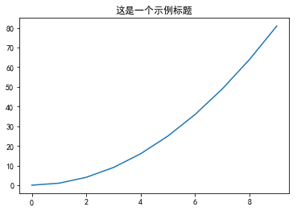


# 2. 添加文字-text

设置坐标和文字即可


```python
import numpy as np
import matplotlib.pyplot as plt
# 显示中文
plt.rcParams['font.sans-serif'] = [u'SimHei']
plt.rcParams['axes.unicode_minus'] = False
%matplotlib inline
x=np.arange(-10,11,1)
y=x*x
plt.plot(x,y)
plt.title('这是一个示例标题')
# 添加文字
plt.text(-2.5,30,'function y=x*x')
plt.show()
```


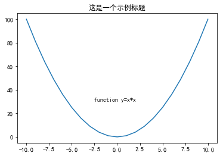


# 3. 添加注释-annotate

- xy：为备注的坐标点
- xytext：备注文字的坐标(默认为xy的位置)
- arrowprops：在xy和xytext之间绘制一个箭头


```python
import numpy as np
import matplotlib.pyplot as plt
# 显示中文
plt.rcParams['font.sans-serif'] = [u'SimHei']
plt.rcParams['axes.unicode_minus'] = False
%matplotlib inline
x=np.arange(-10,11,1)
y=x*x
plt.title('这是一个示例标题')
plt.plot(x,y)
# 添加注释
plt.annotate('这是一个示例注释',xy=(0,1),xytext=(-2,22),arrowprops={'headwidth':10,'facecolor':'r'})
plt.show()
```


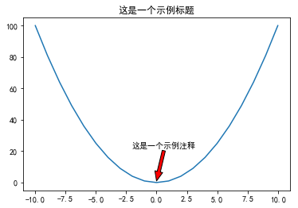


# 4. 设置坐标轴名称-xlabel/ylabel


```python
import numpy as np
import matplotlib.pyplot as plt
# 显示中文
plt.rcParams['font.sans-serif'] = [u'SimHei']
plt.rcParams['axes.unicode_minus'] = False
%matplotlib inline
x=np.arange(1,20)
plt.xlabel('示例x轴')
plt.ylabel('示例y轴')
plt.plot(x,x*x)
plt.show()
```


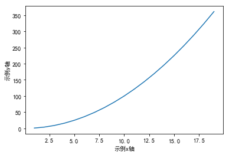


# 5. 添加图例-legend


```python
import numpy as np
import matplotlib.pyplot as plt
# 显示中文
plt.rcParams['font.sans-serif'] = [u'SimHei']
plt.rcParams['axes.unicode_minus'] = False
%matplotlib inline
plt.plot(x,x)
plt.plot(x,x*2)
plt.plot(x,x*3)
plt.plot(x,x*4)
# 直接传入legend
plt.legend(['生活','颜值','工作','金钱'])
plt.show()
```


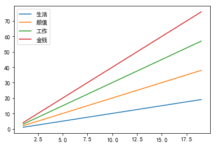


# 6.调整颜色-color

传颜色参数，支持以下几种方式


```python
import numpy as np
import matplotlib.pyplot as plt
%matplotlib inline
x=np.arange(1,5)
#颜色的几种方式
plt.plot(x,color='g')
plt.plot(x+1,color='0.5')
plt.plot(x+2,color='#FF00FF')
plt.plot(x+3,color=(0.1,0.2,0.3))
plt.show()
```


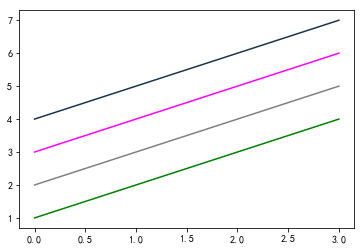


# 7.切换线条样式-marker


```python
import numpy as np
import matplotlib.pyplot as plt
%matplotlib inline
x=np.arange(1,5)
plt.plot(x,marker='o')
plt.plot(x+1,marker='>')
plt.plot(x+2,marker='s')
plt.show()
```


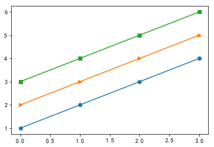


# 8.显示数学公式-mathtext

格式如下： 作为开始和结束符，如\omega $，中间的将解析出公式中的符号


```python
import numpy as np
import matplotlib.pyplot as plt
%matplotlib inline
plt.title('chenqionghe')
plt.xlim([1,8])
plt.ylim([1,5])
plt.text(2,4,r'$ \alpha \beta \pi \lambda \omega $',size=25)
plt.text(4,4,r'$ \sin(0)=\cos(\frac{\pi}{2}) $',size=25)
plt.text(2,2,r'$ \lim_{x \rightarrow y} \frac{1}{x^3} $',size=25)
plt.text(4,2,r'$ \sqrt[4]{x}=\sqrt{y} $',size=25)
plt.show()
```


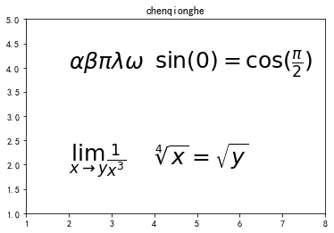


# 9. 显示网格-grid


```python
import numpy as np
import matplotlib.pyplot as plt
%matplotlib inline
x='a','b','c','d'
y=[15,30,45,10]
plt.grid()
# 也可以设置颜色、线条宽度、线条样式
# plt.grid(color='g',linewidth='1',linestyle='-.')
plt.plot(x,y)
plt.show()
```


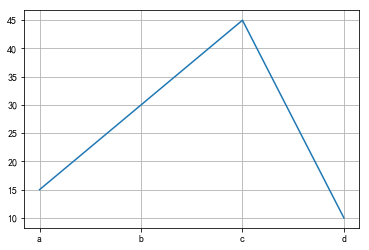


# 10. 调整坐标轴刻度-locator_params

同时调整x轴和y轴：plt.locator_params(nbins=20)只调整x轴：

plt.locator_params(‘'x',nbins=20)只调整y轴：plt.locator_params(‘'y',nbins=20)


```python
import numpy as np
import matplotlib.pyplot as plt
%matplotlib inline
x=np.arange(0,30,1)
plt.plot(x,x)
# x轴和y轴分别显示20个
plt.locator_params(nbins=20)
plt.show()
```


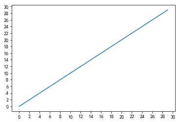


# 11. 调整坐标轴范围-axis/xlim/ylim

- axis：[0,5,0,10]，x从0到5，y从0到10
- xlim：对应参数有xmin和xmax，分别能调整最大值最小值
- ylim：同xlim用法


```python
import numpy as np
import matplotlib.pyplot as plt
%matplotlib inline
x=np.arange(0,30,1)
plt.plot(x,x*x)
#显示坐标轴，plt.axis(),4个数字分别代表x轴和y轴的最小坐标，最大坐标
#调整x为10到25
plt.xlim(xmin=10,xmax=25)
plt.plot(x,x*x)
plt.show()
```


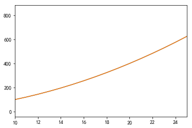


# 12. 调整日期自适应-autofmt_xdate

有时候显示日期会重叠在一起，非常不友好，调用plt.gcf().autofmt_xdate()，将自动调整角度


```python
import numpy as np
import pandas as pd
import matplotlib.pyplot as plt
%matplotlib inline
x=pd.date_range('2020/01/01',periods=30)
y=np.arange(0,30,1)
plt.plot(x,y)
plt.gcf().autofmt_xdate()
plt.show()
```


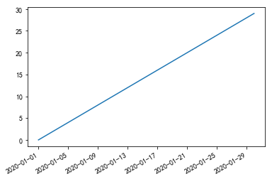


# 13. 添加双坐标轴-twinx


```python
import numpy as np
import matplotlib.pyplot as plt
%matplotlib inline
x=np.arange(1,20)
y1=x*x
y2=np.log(x)
plt.plot(x,y1)
# 添加一个坐标轴，默认0到1
plt.twinx()
plt.plot(x,y2,'r')
plt.show()
```


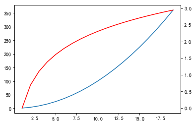


# 14. 填充区域-fill/fill_beween

fill填充函数区域


```python
import numpy as np
import matplotlib.pyplot as plt
# 显示中文
plt.rcParams['font.sans-serif'] = [u'SimHei']
plt.rcParams['axes.unicode_minus'] = False
%matplotlib inline
x=np.linspace(0,5*np.pi,1000)
y1=np.sin(x)
y2=np.sin(2*x)
plt.plot(x,y1)
plt.plot(x,y2)
# 填充
plt.fill(x,y1,'g')
plt.fill(x,y2,'r')
plt.title('这是一个示例标题')
plt.show()
```


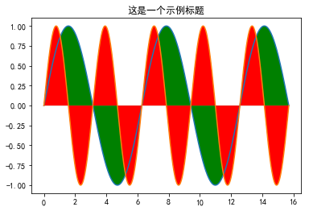


fill_beween填充函数交叉区域


```python
import numpy as np
import matplotlib.pyplot as plt
# 显示中文
plt.rcParams['font.sans-serif'] = [u'SimHei']
plt.rcParams['axes.unicode_minus'] = False
%matplotlib inline
plt.title('这是一个示例标题')
x=np.linspace(0,5*np.pi,1000)
y1=np.sin(x)
y2=np.sin(2*x)
plt.plot(x,y1)
plt.plot(x,y2)
# 填充
plt.fill_between(x,y1,y2,where=y1>y2,interpolate=True)
plt.show()
```


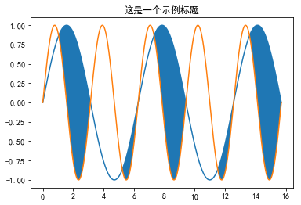


# 15. 画一个填充好的形状-matplotlib.patche


```python
import numpy as np
import matplotlib.pyplot as plt
import matplotlib.patches as mptaches
%matplotlib inline
xy1=np.array([0.2,0.2])
xy2=np.array([0.2,0.8])
xy3=np.array([0.8,0.2])
xy4=np.array([0.8,0.8])
fig,ax=plt.subplots()
#圆形,指定坐标和半径
circle=mptaches.Circle(xy1,0.15)
ax.add_patch(circle)
#长方形
rect=mptaches.Rectangle(xy2,0.2,0.1,color='r')
ax.add_patch(rect)
#多边形
polygon=mptaches.RegularPolygon(xy3,6,0.1,color='g')
ax.add_patch(polygon)
# 椭圆
ellipse=mptaches.Ellipse(xy4,0.4,0.2,color='c')
ax.add_patch(ellipse)
ax.axis('equal')
plt.show()
```


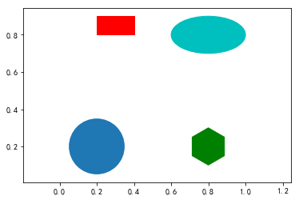


# 16.切换样式-plt.style.use

matplotlib支持多种样式，可以通过plt.style.use切换样式，例如：`plt.style.use('ggplot')`输入 `plt.style.available` 可以查看所有的样式:


```python
import matplotlib.pyplot as plt
plt.style.available
```


    ['bmh',
     'classic',
     'dark_background',
     'fast',
     'fivethirtyeight',
     'ggplot',
     'grayscale',
     'seaborn-bright',
     'seaborn-colorblind',
     'seaborn-dark-palette',
     'seaborn-dark',
     'seaborn-darkgrid',
     'seaborn-deep',
     'seaborn-muted',
     'seaborn-notebook',
     'seaborn-paper',
     'seaborn-pastel',
     'seaborn-poster',
     'seaborn-talk',
     'seaborn-ticks',
     'seaborn-white',
     'seaborn-whitegrid',
     'seaborn',
     'Solarize_Light2',
     'tableau-colorblind10',
     '_classic_test']


```python
import numpy as np
import matplotlib.pyplot as plt
import matplotlib.patches as mptaches
%matplotlib inline
plt.style.use('ggplot')
# 新建4个子图
fig,axes=plt.subplots(2,2)
ax1,ax2,ax3,ax4=axes.ravel()
# 第一个图
x,y=np.random.normal(size=(2,100))
ax1.plot(x,y,'o')
# 第二个图
x=np.arange(0,10)
y=np.arange(0,10)
colors=plt.rcParams['axes.prop_cycle']
length=np.linspace(0,10,len(colors))
for s in length:
    ax2.plot(x,y+s,'-')
# 第三个图
x=np.arange(5)
y1,y2,y3=np.random.randint(1,25,size=(3,5))
width=0.25
ax3.bar(x,y1,width)
ax3.bar(x+width,y2,width)
ax3.bar(x+2*width,y3,width)
# 第四个图
for i,color in enumerate(colors):
    xy=np.random.normal(size=2)
ax4.add_patch(plt.Circle(xy,radius=0.3,color=color['color']))
ax4.axis('equal')
plt.show()
```


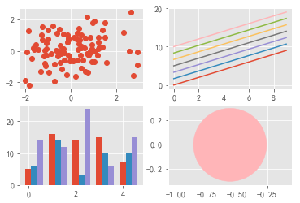


```python

```
